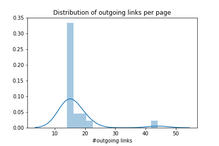
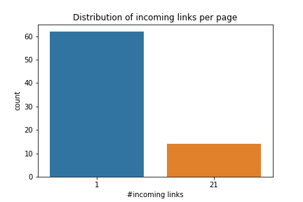
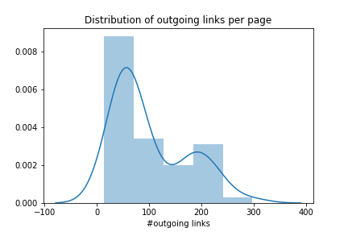
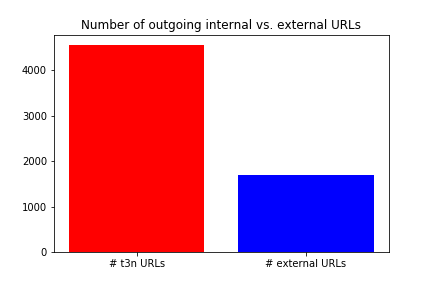

# Praktikum 1: Janik Tinz, Patrick Tinz, Tobias Rohrer (Gruppe X-D)

## Allgemein
* Link zum GitHub Repo: [https://github.com/tobirohrer/webmining](https://github.com/tobirohrer/webmining)

## Vorbereitung 

In der ersten Phase hat sich herausgestellt, dass die Website von [t3n.de](https://t3n.de) ausreichend Inhalte sowie Links zum Crawlen beinhaltet. Deshalb haben wir uns im ersten Praktikum ausschließlich auf [t3n.de](https://t3n.de) fokussiert.


* Format von seiteninternen URLs:
https://t3n.de/news/<titel_des_artikels>

* Relevante Informationen des DOM-Baums:
    * Kategorie des Artikels: `class="o-list c-breadcrumb"`, `class="u-text-extrasmall u-color-mute u-link-simple"`
    * Überschrift des Artikels: `class="u-gap-medium u-text-extralarge"`
    * Teaser-Text des Artikels: `class="u-text-teaser"`
    * Text-Inhalt des Artikels: `class="c-entry"`

* Beispiel (HTML-Auszug):
URL: https://t3n.de/news/starlink-spacex-60-satelliten-1219838/ (Zugegriffen am 11.11.2019)

## Teil 1
Diese Aufgabe wurde im Juypter Notebook [p1\_regulaere\_ausdrucke](https://github.com/tobirohrer/webmining/blob/master/praktikum1/p1_regulaere_ausdruecke.ipynb) bearbeitet. 

Anmerkung zu Übung 3: Hier haben wir `-.2` zusätzlich in unsere Ergebnismenge aufgenommen.   
Anmerkung zu Übung 5: Hier haben wir zwei Reguläre Ausdrücke gefunden. Der erste RegEx extrahiert nur neunstellige Postleitzahlen. Der zweite RegEx extrahiert  fünf- oder neunstellige Postleitzahlen.

## Teil 2
1. Klinik.xml:
    * a.) `//Pfleger[@Station='Rehabilitation']/Name/*/text()`   
    Es werden alle untergeordneten Knoten von Pfleger sowie der Knoten Pfleger selektiert. Die Selektierung des Pfleger Knotens wird mithilfe eines Prädikats weiter eingeschränkt. Die Einschränkung erfolgt über das Attribut `@Station='Rehabilitation'`. Anschließend werden über den Unterknoten `Name` der Vorname und der Nachname selektiert. 
    * b.) `//Stationen/Station[contains(Standort,'Seestrasse') and count(Bett)>2]/Name/text()`   
    Es werden alle untergeordneten Knoten von Stationen sowie der Knoten Stationen selektiert. Im nächsten Schritt werden über den Knoten Station mithilfe des Prädikats `contains(Standort,'Seestrasse') and count(Bett)>2` alle Stationen in der Seestraße, die mehr als zwei Betten haben selektiert. Abschließend wird über den Knoten `Name` der Name ausgewählt.
    * c.) `//Pfleger[@ID=/Klinik/Stationen/Station/@Leitung]/Name/Nachname/text()`   
    Zunächst werden alle untergeordneten Knoten von Pfleger sowie der Knoten Pfleger selektiert. Als nächstes werden mithilfe des Prädikats `@ID=/Klinik/Stationen/Station/@Leitung` alle Pfleger ausgewählt, die eine Station leiten. Anschließend wird der Nachname der leitenden Pfleger ermittelt.
    * d.) `//angestelltes_Personal/*/Adresse[Stadt='Berlin']/preceding-sibling::Name/*/text()`   
    Als erstes werden alle untergeordneten Knoten von `angestelltes_Personal` sowie der Knoten `angestelltes_Personal` selektiert. Im nächsten Schritt wird über den Knoten `Adresse` ermittelt, welche Mitarbeiter in Berlin wohnen.
2. Hamlet.xml:
    * a.) `//SCENE[count(SPEECH) < 10]/TITLE/text()`
    Zunächst werden alle untergeordneten Knoten von SCENE sowie der Knoten SCENE selektiert. Anschließend werden über das Prädikat `count(SPEECH) < 10` alle Titel, die weniger als zehn Sprechakte haben, ermittelt.
    * b.) `//ACT/SCENE/SPEECH/LINE/text()[contains(.,"Part them; they are incensed.")]/../../preceding-sibling::STAGEDIR[position() = count(//ACT/SCENE/SPEECH/LINE/text()[contains(.,"Part them; they are incensed.")])]/text()`  
    Der XPath Ausdruck `//ACT/SCENE/SPEECH/LINE/text()[contains(.,"Part them; they are incensed.")]` selektiert den Knoten `LINE`, in welchem der Text "Part them; they are incensed." steht. Anschließend wird zwei Knotenebenen zurück navigiert. Im Weiteren wird der Knoten `STAGEDIR` mithilfe eines Prädikats selektiert. In dem Prädikat wird der Knoten `STAGEDIR` ausgewählt, bevor King Claudius sagt "Part
them; they are incensed.".
    * c.) 
        * `//ACT//SPEECH[position() = 2]/SPEAKER/text()`   
        Dieser Ausdruck wählt das zweite SPEECH Element des Elternknotens aus.
        * `//ACT//SPEECH[position() = 187]/SPEAKER/text()`
        Dieser Ausdruck wählt das 187. SPEECH Element des Elternknotens aus (In der Hamlet.xml Datei liefert dieser Befehl keine Ausgabe.).   
        * `//ACT/descendant::SPEECH[position() = 2]/SPEAKER/text()`  
        Dieser Ausdruck wählt das zweite SPEECH Element vom ACT Element aus.
        * `//ACT/descendant::SPEECH[position() = 187]/SPEAKER/text()`
        Dieser Ausdruck wählt das 187. SPEECH Element vom ACT Element aus.

3. XPath-Ausdrücke für unser Text-Mining Projekt: 
    * Überschrift: `//h2[@class='u-gap-medium u-text-extralarge']/text()`   
    Die Überschrift eines Artikels ist immer mit der Klasse `'u-gap-medium u-text-extralarge'` gekennzeichnet.
    * Teaser: `//p[@class='u-text-teaser']/text()`   
    Der Teaser eines Artikels ist immer mit der Klasse `'u-text-teaser'` gekennzeichnet. 
    * Text: `//p[@class='u-text-teaser']/following-sibling::p//text()`   
    Der Inhalt eines Artikels steht in einem p-Tag mit der Klasse `'u-text-teaser'`.
    * Kategorie: `//ul[@class='o-list c-breadcrumb']/li[position() = 2]/a[@class='u-text-extrasmall u-color-mute u-link-simple']/text()`   
    Die Kategorie eines Artikels steht in einem Unterknoten des ul-Tags mit der Klasse `'o-list c-breadcrumb'`. Die Unterknoten sind li-Tags, wobei sich die Kategorie im zweiten li-Tag befindet. In diesem li-Tag steht die Kategorie in einem a-Tag. Die Kategorie kann schließlich über die Klasse `'u-text-extrasmall u-color-mute u-link-simple'` ermittelt werden.

## Teil 3

### 3.1 Implementierung Scrapy Crawler

Wir haben uns bei der Implementierung unserer Crawler für Link- und Content-Extraction zunächst auf die URL [https://t3n.de/news](https://t3n.de/news) konzentriert. Dafür wurden die zwei Klassen `T3nUrlSpider` und `T3nDataSpider` implementiert.

#### T3nUrlSpider
Der T3nUrlSpider wurde so konfiguriert, dass er sich ausschließlich auf [t3n.de](https://t3n.de) bewegt, jedoch ausgehende URLs zu jeder beliebigen Seite extrahiert.

```
class T3nUrlSpider(scrapy.Spider):
    name = 't3n_url_spider'
    allowed_domains = ['t3n.de']
    start_urls = ['https://t3n.de/news']

    def parse(self, response):
        extractor = LinkExtractor()
        links = extractor.extract_links(response)

        for link in links:
            absolute_next_page_url = response.urljoin(link.url)
            yield {'from': response.url, 
                   'url': link.url, 
                   'text': link.text.strip()}
            yield scrapy.Request(absolute_next_page_url)
```

#### T3nDataSpider
Der T3nDataSpider extrahiert ausschließlich URLs, die auf die `/news` Subdomain zielen. Somit wird gesteuert, wie sich der T3nDataSpider "fortbewegt". Die XPath-Ausdrücke für die zu extrahierenden Informationen sind in Teil 2.3 definiert.

```
class T3nDataSpider(scrapy.Spider):
    name = 't3n_data_spider'
    allowed_domains = ['t3n.de']
    start_urls = ['https://t3n.de/news']

    def parse(self, response):

        ... # xpath expressions see Teil 2.3
        
                yield {'category': category, 
               'heading': heading, 
               'teaser': teaser, 
               'text': text, 
               'url': response.url}

        extractor = LinkExtractor(allow='news', allow_domains=self.allowed_domains)
        links = extractor.extract_links(response)

        for link in links:
            absolute_next_page_url = response.urljoin(link.url)
            yield scrapy.Request(absolute_next_page_url)
```

Die Abbruchbedingung unserer Spider wurde zunächst auf einen Pagecount von jeweils 50 Seiten definiert. Hierfür musste im CrawlerProcess die folgende Eigenschaft gesetzt werden:

```
    c = CrawlerProcess({
        'CLOSESPIDER_PAGECOUNT': 50,
        ...
    })
```

### 3.2 Link Analyse DarmstadtSpider
Die Link Analyse wurde in dem Jupyter Notebook [link\_analysis\_DarmstadtSpider](https://github.com/tobirohrer/webmining/blob/master/praktikum1/link_analysis_DarmstadtSpider.ipynb) realisiert.

#### Data Preprocessing

Um mit den Auswertungen starten zu können, mussten zunächst die Daten bereinigt werden. Viele URLs wurden mehrfach mit unterschiedlichen URL-Parametern für die Darstellung verlinkt. Für unsere Auswertung mussten diese aus dem Datensatz entfernt werden. Mit einer einfachen Abfrage konnte dies realisiert werden.

```
df = df.loc[~df['from'].str.contains('(\?|\&)(tx_contrast|type=97)')]
```

#### Top-Level Domain Statisitk
Zunächst wurde den Daten eine Spalte `tld` mit der zugehörigen Top-Level Domain eingefügt.

```
df['tld'] = df.url.map(lambda url:  get_tld(url, fail_silently=True))
```

Nachdem die Informationen in der Spalte `tld` vorhanden waren, konnte ein `Countplot` über die Verteilung erstellt werden.


#### Outgoing / Incoming URL Statistik

Die Statistik über die Anzahl an ausgehenden Links pro Seite sieht für den DarmstadtSpider wie folgt aus.
Es ist zu erkennen, dass die meisten Seiten in etwa 15 ausgehende Links beinhalten. Die wenigsten Seiten beinhalten mehr als 20 ausgehende Links.



Auf dem Plot für die eingehenden Links pro Seite ist zu erkennen, dass es wenige Seiten mit 21 eingehenden Links, jedoch sehr viele Seiten mit nur einem eingehenden Link gibt. Seiten mit 21 eingehenden Links sind auf jeder Unterseite verlinkt. Zum Beispiel in dem "Oft gesucht" Menü der Navigationsleiste.




### 3.3 Link Analyse t3n
Die Link Analyse wurde in dem Jupyter Notebook  und [link\_analysis\_t3n](https://github.com/tobirohrer/webmining/blob/master/praktikum1/link_analysis_t3n.ipynb) realisiert.

#### Statistiken aus 3.2 für t3n
Auf den nachfolgenden Plots ist zu erkennen, dass die Seiten auf [t3n/news](https://t3n.de/news/) generell mehr eingehende sowie ausgehende Links, als   die Seiten auf [https://www.darmstadt.de/leben-in-darmstadt](https://www.darmstadt.de/leben-in-darmstadt) enthalten.





#### Zusätzliche Statistiken
Zunächst sollte geklärt werden, wie viele URLs von t3n auf externe Seiten zeigen. Der nachfolgende Plot zeigt das Verhältnis von t3n zu externen URLs. Diese Statistik war die Grundlage für die Erkenntnis, dass t3n neben Content auch ausreichend Links zum Crawlen enthält.



Außerdem wurde der Datensatz in einer Graph-Datenstruktur abgespeichert. Das ermöglicht uns in Zukunft auf einfache Weise Graph-Algorithmen sowie Netwerk-Plots zu realisieren. Hierfür wurden zunächst alle URLs auf ihre Domain getrimmt. 

```
graph = pd.DataFrame()
graph['to'] = t3n.url.map(lambda url:  tldextract.extract(url).domain)
graph['from'] = t3n['from'].map(lambda url:  tldextract.extract(url).domain)
```

Die Summe aller gleichen Verlinkungen nach dem trimmen, wurde als Gewichtung einer Kante im Graph abgespeichert.

``` 
graph = graph.groupby(['to', 'from']).size().reset_index(name='weight')
```

Zu guter Letzt wird der DataFrame dann noch in eine Graph-Datenstruktur überführt. In unserem Beispiel unten überführen wir nur alle Verlinkungen, die mehr als 10 mal auftreten. Zur Unterstützung haben wir die Python Bibliothek `networkx` verwendet.

```
import networkx as nx
...
G = nx.DiGraph()
for index, row in graph.iterrows():
    if(row['weight'] > 10): #Optional
        G.add_edge(row['from'], row['to'], weight=row['weight'])
```


Nachstehend ist ein beispielhafter Plot des Graphen zu sehen. Es werden Seiten, die öfter als 10 mal von t3n verlinkt werden, gezeigt.


