# Praktikum 2: Janik Tinz, Patrick Tinz, Tobias Rohrer (Gruppe X-D)

## Allgemein
* Link zum GitHub Repo: [https://github.com/tobirohrer/webmining](https://github.com/tobirohrer/webmining)

## Vorbereitung 
Bei der Umsetzung der Aufgabenstellung wurde das Datenbank Tool [DBeaver](https://dbeaver.io/) verwendet, da das HANA Eclipse Plugin Verbindungsprobleme verursachte. 

### Verbinden mit HANA VM
#### SQL Statement   
```select top 10 * from SYSTEM.CMPL100K``` (Ausgabe der ersten zehn Zeilen der Tabelle CMPL100K)
#### Verbindung mit Python
Die Durchführung des Beispielskripts befindet sich im Juypter Notebook [p2_preparation](https://github.com/tobirohrer/webmining/blob/master/praktikum2/p2_preparation.ipynb). 

### Python Extraktionsskript
Das Extraktionsskript befindet sich im Jupyter Notebook [praktikum2_sql](https://github.com/tobirohrer/webmining/blob/master/praktikum2/praktikum2_sql.ipynb). 

### Hintergrund der „NHTSA Complaints Datenbank“ 
Die National Highway Traffic Safety Administration (NHTSA) ist eine zivile Bundesbehörde in den USA für Straßen- und Fahrzeugsicherheit. 

##### Aufbau der Datenstruktur (Interessante Spalten)
* CMPLID: NHTSA'S INTERNAL UNIQUE SEQUENCE NUMBER
* CDESCR: Beschreibung der Beschwerde
* MFR_NAME: Autohersteller

### Statistiken für unsere Webdaten
* Die Verteilung der Top 20 Wörter vor bzw. nach den Löschen der Stop Words 
* Die Verteilung der Top 20 Part of Speech Tags

## Teil 1: Informationsextraktion und Textzerlegung
### 1.1 - 1.4
Diese Aufgaben wurden im Jupyter Notebook [praktikum2](https://github.com/tobirohrer/webmining/blob/master/praktikum2/praktikum2.ipynb) bearbeitet.  

### 1.5/ 1.6 Linguistische Analyse
#### Erstellung von einem Text-Index 
* CONFIGURATION 'LINGANALYSIS_BASIC'   
```CREATE FULLTEXT INDEX "T3NTEXTIND" ON "SYSTEM"."T3N" ("TEXT") CONFIGURATION 'LINGANALYSIS_BASIC' ASYNC LANGUAGE DETECTION ('de', 'en') TEXT ANALYSIS ON```

* CONFIGURATION 'LINGANALYSIS_STEMS'   
```CREATE FULLTEXT INDEX "T3NTEXTIND" ON "SYSTEM"."T3N" ("TEXT") CONFIGURATION 'LINGANALYSIS_STEMS' ASYNC LANGUAGE DETECTION ('de', 'en') TEXT ANALYSIS ON```

* CONFIGURATION 'LINGANALYSIS_FULL'   
```CREATE FULLTEXT INDEX "T3NTEXTIND" ON "SYSTEM"."T3N" ("TEXT") CONFIGURATION 'LINGANALYSIS_FULL' ASYNC LANGUAGE DETECTION ('de', 'en') TEXT ANALYSIS ON```

#### Löschen von einem Text-Index   
```DROP FULLTEXT INDEX "T3NTEXTIND";```

Welche Informationen werden dort zur Verfügung gestellt und welchen in der Vorlesung besprochenen Konzepten entsprechen diese? 
* CONFIGURATION 'LINGANALYSIS_BASIC'
    * Tokenisierung
* CONFIGURATION 'LINGANALYSIS_STEMS'
    * Tokenisierung
    * Stemming
* CONFIGURATION 'LINGANALYSIS_FULL'
    * Tokenisierung
    * Normalisierung
    * Stemming
    * Part of Speech (POS)

* Tokenisierung: Hierbei werden die textuellen Zeichenketten in linguistische Einheiten zerlegt. Ein Token ist die kleinste segmentierte Einheit eines Textes.
    * TA_TOKEN: Die einzelnen Tokens werden aufgelistet.
* Normalisierung: Dieses Verfahren wird in mehreren Schritten durchgeführt. Im ersten Schritt werden diakritische Zeichen umgewandelt. Dann werden die Großbuchstaben in reine Kleinbuchstaben überführt. Abschließend werden die Punkte, Apostrophe etc. entfernt. 
    * TA_NORMALIZED -> TA_TOKEN: Jubiläen -> jubilaeen (Beispiel aus unseren Webdaten)
* Stemming: Hierbei werden die Wörter nach relativ groben Regelen verändert. Das Problem ist, dass es häufig zu fehlerhaften Veränderungen kommt, da Sprachen sehr komplexe Konstrukte haben.
    * TA_TOKEN -> TA_STEM: Änderungen -> Änderung, fürs -> für=das (Beispiele aus unseren Webdaten)
* Part of Speech (POS): Bei diesem Verfahren wird jedem Token in einem Satz die korrekte Wortart zugeordnet. 
    * TA_TOKEN -> TA_TYPE: möglicherweise -> adverb (Beispiel aus unseren Webdaten)

Wo gibt es ggf. Probleme mit der Datenqualität und wie könnten Sie diese beheben? 
* Probleme mit der Datenqualität: Es werden einige Tokens bei der Verwendung von Stemming verändert. Ein Beispiel ist: Ladezeit -> Lade#Zeit. Der Grund für dieser Veränderung ist, dass beim Stemming regelbasierte Veränderungen von Wörtern durchgeführt werden. 
* Lösungsansätze: Eine Lösung wäre die Verwendung von Lemmatisierung, da bei diesem Verfahren die Wörter auf ihre Stammform mit Hilfe von Wörterbüchern und von grammatikalischer Analyse zurückgeführt werden.

## Teil 2: Reporting auf zerlegten Texten
### Statistiken mit SQL und Visualisierung mit Python - NHTSA-Complaints
Diese Aufgaben wurden im Juypter Notebook [praktikum2_NHTSA_sql](https://github.com/tobirohrer/webmining/blob/master/praktikum2/praktikum2_NHTSA_sql.ipynb) bearbeitet.

#### 2.1 SQL-View - Worthäufigkeiten (nur Nomen) pro Dokument
Das folgende Listing veranschaulicht die Erzeugung der SQL-View, die die Worthäufigkeit (nur Nomen) pro Dokument enthält.
``` python
sql = 'create view COUNT_NOUNS_NHTSA as select CMPLID, TA_TOKEN, count(*) as COUNT from "$TA_CDESCRIND" where TA_TYPE=\'noun\' group by CMPLID, TA_TOKEN'
cursor.execute(sql)
```
Des Weiteren wurde die Anzahl der Nomen in einem Dokument mit Hilfe der folgenden SQL-Query abgefragt.
```sql
select CMPLID, sum(COUNT) from COUNT_NOUNS_NHTSA group by CMPLID order by sum(COUNT) desc
```
Folgender Plot zeigt die Worthäufigkeit der Nomen:   
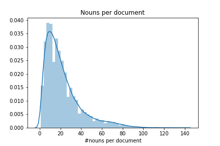   
Es ist zu erkennen, dass im Mittel ca. 20 Nomen in einem Dokument vorkommen. Des Weiteren wurde im Jupyter Notebook [praktikum2_NHTSA_sql](https://github.com/tobirohrer/webmining/blob/master/praktikum2/praktikum2_NHTSA_sql.ipynb) die Worthäufigkeit bestimmter Nomen in einem Dokument ausgegeben.

#### 2.2 Lexikon
Das Lexikon der Tabelle CMPL100K besitzt 71649 Tokens. Im nächsten Schritt wurden Satzzeichen und Zahlen aus dem Lexikon entfernt. Das Lexikon hatte dann noch eine Größe von 63447. Dieser Schritt wurde mit einer einfachen SQL-Query umgesetzt. Im nächsten Listing ist die Query gezeigt. 
```sql
select distinct TA_TOKEN from "$TA_CDESCRIND" where TA_TYPE <> \'punctuation\' and TA_TYPE <> \'number\'
```
Des Weiteren sollte man häufige vorkommende Wörter löschen, dies kann durch das Löschen der sogenannten Stopwords erreicht werden. Nach dem Löschen dieser Wörter hatte das Lexikon eine Größe von 63295. Außerdem wurde die durchschnittliche Länge eines Dokuments untersucht. Die durchschnittliche Länge liegt bei ca. 101,25 Zeichen. Die Abfrage dieser Länge wurde über eine weitere SQL-View realisiert.
Im folgenden Listing ist die Erstellung der View gezeigt.
```sql
create view COUNT_TOKEN_NHTSA as select CMPLID, count(*) as COUNT from "$TA_CDESCRIND" group by CMPLID order by count(*) desc
```
Schließlich wurde die durchschnittliche Länge eines Dokuments über folgende SQL-Abfrage abgerufen.
```sql
select avg(COUNT) from COUNT_TOKEN_NHTSA
```

Als nächstes wurde die durchschnittliche Länge eines Satzes über folgende SQL-Query abgefragt.
```sql
select AVG(TA_SENTENCE) as AVG_SENTENCE from "$TA_CDESCRIND" order by AVG(TA_SENTENCE) desc
```
Die durchschnittliche Satzlänge beträgt ca. 4,88 Zeichen.

#### 2.3 Verteilung von Worthäufigkeiten
Die Verteilung der Nomen im Datensatz NHTSA-Complaints ist im nachfolgenden Plot gezeigt.
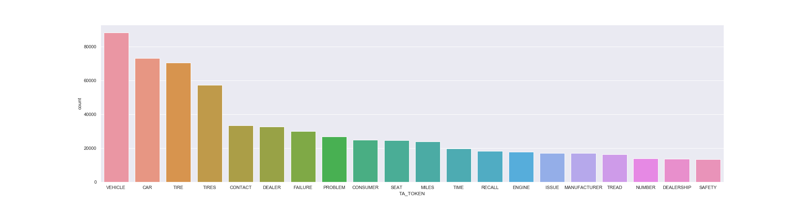
Der Plot zeigt, dass in dem Datensatz NHTSA-Complaints sehr viel über Vehicle und car gesprochen wird. Im Weiteren werden Wörter wie bspw. number oder saftey seltener genannt. 

Die Worthäufigkeit der Nomen lassen sich ebenfalls sehr aussagekräfig in einer Wordcloud darstellen. 


In der Wordcloud sind die drei am häufigsten vorkommenden Nomen (vehicle, car, tire) am größten dargestellt. 

#### 2.4 Mehrdeutigkeit von Wörtern
Die Mehrdeutigkeit von Wörtern in einem Dokument wurde mit Hilfe einer SQL-View realisiert. Im folgenden Listing ist die Erzeugung der SQl-View gezeigt.

```sql
create view POSTAGS_NHTSA as select TA_NORMALIZED as nor, CMPLID as id, TA_TYPE as type, count(*) as count_words from "$TA_CDESCRIND" where TA_TYPE = \'noun\' or TA_TYPE = \'verb\' or TA_TYPE = \'adjective\' group by TA_NORMALIZED, CMPLID, TA_TYPE having count(*)>1
```

Im Weiteren wurde eine SQL-Abfrage an die SQL-View gestellt, welche mehrdeutige Wörtern in einem Dokument zurückgibt. Die Wörter wurden nach ihrer Mehrdeutigkeit sortiert. 

```sql
select NOR, ID, count(NOR) from POSTAGS_NHTSA group by NOR, ID having count(NOR) > 1
```

Im Ergebnis stellte sicher heraus, dass Wörter maximal zwei POS-Tags zugeordnet wurden.    
Beispiele hierfür sind:   
* put (Adjektiv und Verb)
* concrete (Nomen und Adjektiv)
* rental (Nomen und Adjektiv)

#### 2.5 Eigene sinnvolle Statistiken und Visualisierungen 


### Statistiken mit SQL und Visualisierung mit Python - T3N
Diese Aufgaben wurden im Juypter Notebook [praktikum2_sql](https://github.com/tobirohrer/webmining/blob/master/praktikum2/praktikum2_sql.ipynb) bearbeitet.

#### 2.1 SQL-View - Worthäufigkeiten (nur Nomen) pro Dokument
Das folgende Listing zeigt die Erstellung der SQL-View, welche die Worthäufigkeit (nur Nomen) pro Dokument enthält.   
``` python
sql = 'create view COUNT_NOUNS as select ID, TA_TOKEN, count(*) as COUNT from "$TA_T3NTEXTIND" where TA_TYPE=\'noun\' group by ID, TA_TOKEN'
cursor.execute(sql)
```
Im Weiteren wurde die Anzahl der Nomen in einem Dokument mit Hilfe der folgenden SQL-Query abgefragt.
```sql
select ID, sum(COUNT) from COUNT_NOUNS group by ID order by sum(COUNT) desc
```
Die Antwort wurde in folgendem Plot graphisch dargestellt.
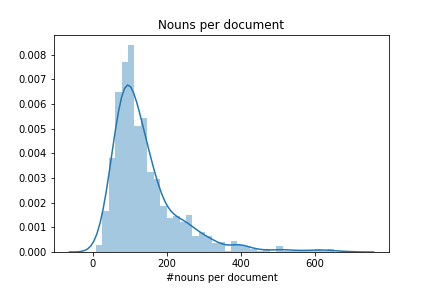   
Es ist zu erkennen, dass im Mittel ca. 100 Nomen in einem Dokument vorkommen. Des Weiteren wurde im Jupyter Notebook [praktikum2_sql](https://github.com/tobirohrer/webmining/blob/master/praktikum2/praktikum2_sql.ipynb) die Worthäufigkeit bestimmter Nomen in einem Dokument ausgegeben.

#### 2.2 Lexikon
Das Lexikon in unseren Datenbank besitzt 38117 Tokens. Im nächsten Schritt wurden Satzzeichen und Zahlen aus dem Lexikon entfernt. Das Lexikon hatte dann noch eine Größe von 37569. Dieser Schritte konnte mithilfe einer einfachen SQL-Query umgesetzt. Im nächsten Listing ist die Query gezeigt. 
```sql
select distinct TA_TOKEN from "$TA_T3NTEXTIND" where TA_TYPE <> \'punctuation\' and 
TA_TYPE <> \'number\'
```
Im Weiteren sollte man häufige vorkommende Wörter löschen, dies kann durch das Löschen der sogenannten Stopwords erreicht werden. Nach dem Löschen dieser Wörter hatte das Lexikon eine Größe von 3755. Außerdem wurde die durchschnittliche Länge eines Dokuments untersucht. Die durchschnittliche Länge liegt bei ca. 536,31. Die Abfrage dieser Länge wurde über eine weitere SQL-View realisiert.
Im folgenden Listing ist die Erstellung der View gezeigt.
```sql
create view COUNT_TOKEN as select ID, count(*) as COUNT from "$TA_T3NTEXTIND" group by ID 
order by count(*) desc
```
Schließlich wurde die durchschnittliche Länge eines Dokuments über folgende SQL-Abfrage abgerufen.
```sql
select avg(COUNT) from COUNT_TOKEN
```

Als nächstes wurde die durchschnittliche Länge eines Satzes über folgende SQL-Query abgefragt.
```sql
select AVG(TA_SENTENCE) as AVG_SENTENCE from "$TA_T3NTEXTIND" order by AVG(TA_SENTENCE) desc
```
Als Ergbnis kam eine durchschnittliche Satzlänge von ca. 14,89 heraus. 

#### 2.3 Verteilung von Worthäufigkeiten
Die Verteilung der Nomen im gecrawlten Datensatz ist im nachfolgenden Plot gezeigt.
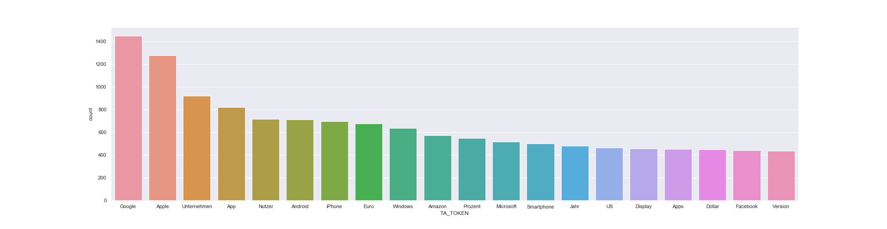
Der Plot zeigt, dass in dem gecrawlten Datensatz sehr viel über Apple und Google gesprochen wird. Im Weiteren werden Unternehmen wie bspw. Amazon, Microsoft oder Facebook nur etwa halb so häufig in den Daten genannt. Außerdem ist zu erwähnen, dass die Begriffe Android und iPhone sogar häufiger vorkommen, als bspw. die Unternehmen Amazon, Microsoft oder Facebook. Diese Ergebnisse deuten darauf hin, dass in dem gecrawlten Datensatz vor allem über die Unternehmen Google und Apple, sowie deren Produkte (z.B.: Android und iPhone) geredet wird. 

Die Worthäufigkeit der Nomen lassen sich ebenfalls sehr aussagekräfig in einer Wordcloud darstellen. 


In der Wordcloud sind die drei am häufigsten vorkommenden Nomen (Google, Apple und Unternehmen) am größten dargestellt. 

Im nächsten Schritt wurde sich betrachtet, wie sich die Wordhäufigkeit der Nomen verändert, wenn wir nur Artikel aus der Kategorie Marketing betrachten. Im nachfolgenden Plot ist die Verteilung der Nomen dargestellt. Es wurden die Top 10 geplottet.

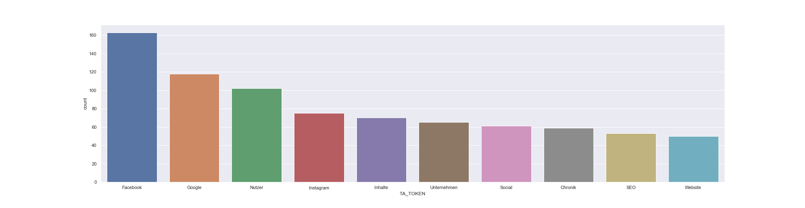

Es ist zu erkennen, dass sich unter den Top 3 die Unternehmen Facebook und Google befinden. Das Unternehmen Apple hingegen ist nicht unter den Top 10 zu finden, obwohl der Begriff Apple häufig im Datensatz vorkommt, wie in der vorangeganenen Anlayse gezeigt wurde. 

#### 2.4 Mehrdeutigkeit von Wörtern
Die Mehrdeutigkeit von Wörtern in einem Dokument wurde mit Hilfe einer SQL-View realisiert. Im folgenden Listing ist die SQL-View gezeigt.

```sql
create view POSTAGS as select TA_NORMALIZED as nor, ID as id, TA_TYPE as type, count(*) as count_words from "$TA_T3NTEXTIND" where TA_TYPE = \'noun\' or TA_TYPE = \'verb\' or TA_TYPE = \'adjective\' group by TA_NORMALIZED, ID, TA_TYPE having count(*)>1
```

Im Weiteren wurde eine SQL-Abfrage an die SQL-View gestellt, welche mehrdeutige Wörtern in einem Dokument zurückgibt. Die Wörter wurden nach ihrer Mehrdeutigkeit sortiert. 

```sql
select NOR, ID, count(NOR) from POSTAGS group by NOR, ID having count(NOR) > 1 order by count(NOR) desc
```

Im Ergebnis stellte sicher heraus, dass Wörter maximal zwei POS-Tags zugeordnet wurden.    
Beispiele hierfür sind:   
* deutsche (Adjektiv und Nomen)
* nutzen (Nomen und Verb)
* bowl (Verb und Nomen)

#### 2.5 Eigene sinnvolle Statistiken und Visualisierungen  
##### 1. Statistik:
In dieser Statistik wurden die am häufigsten verwendeten Adjektiv geplottet.

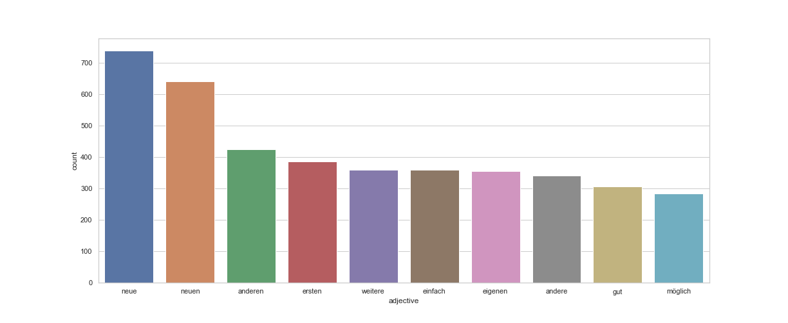

Das Balkendiagramm zeigt, dass häufig die Adjektiv "neue" und "neuen" verwendet werden. Es lässt sich daraus schließen, dass sich in dem Datensatz viele Artikel befinden, welche neue Themen behandeln.

##### 2. Statistik:
Diese Statistik gibt die Verteilung der einzelnen Artikel auf die jeweiligen Kategorien an.

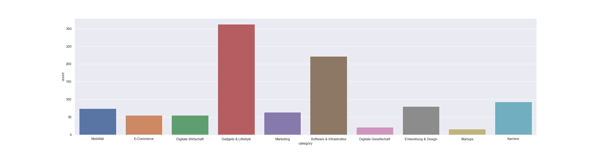

In dem Plot ist zu sehen, dass die meisten Artikel aus der "Kategorie Gadgets" & Lifestyle und "Software & Infrastruktur" stammen. Im Weiteren ist zu erkennen, dass die Kategorien "Digitale Gesellschaft" und "Startups" am wenigsten im Datensatz vertreten sind.

##### 3. Statistik
In diesem Abschnitt wurde sich die Verteilung von häufig vorkommenden Wörter in Bezug auf die einzelnen Kategorien betrachtet.
Es wurden sich die folgenden Wörter/ Unternehmen betrachtet:
* Apple

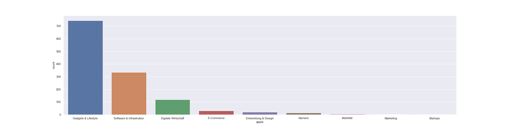

Der Plot zeigt, dass das Unternehmen Apple vor allem häufig im Zusammenhang mit den Kategorien "Gadgets & Lifestyle" und "Software & Infrastruktur" genannt wird.

* Google

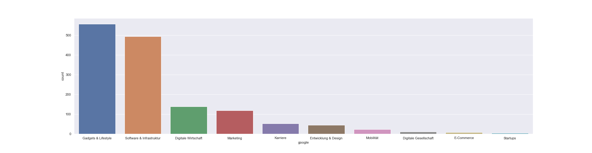

In diesem Plot ist zu sehen, dass das Unternehmen ebenfalls häufig in den Kategorien "Gadgets & Lifestyle" und "Software & Infrastruktur" genannt wird. Es ist allerdings auch anzumerken, dass das Wort Google häufiger in der Kategorie "Marketing" vorkommt als bspw. das Wort Apple.

* Facebook

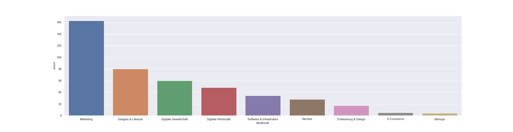

Das Wort Facebook wird vor allem häufig in der Kategorie "Marketing" genannt.

* Microsoft 

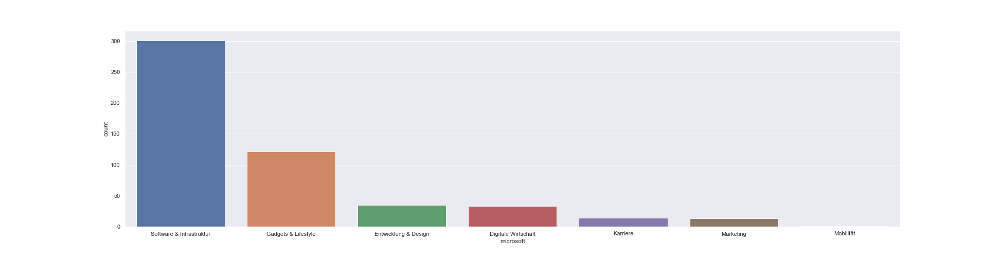

Das Unternehmen Microsoft wird sehr häufig in den Kategorien "Software & Infrastruktur" und "Gadgets & Lifestyle" genannt.

* Amazon

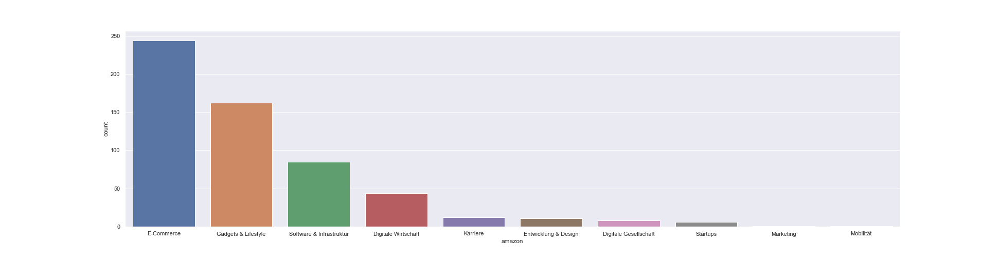

Aus dieser Grafik lässt sich ablesen, dass das Wort Amazon vor allem im Zusammenhang mit den Kategorien "E-Commerce" und "Gadgets & Lifestyle" erwähnt wird. 
