# Praktikum 4: Janik Tinz, Patrick Tinz, Tobias Rohrer (Gruppe X-D)

## Allgemein
* Link zum GitHub Repo: [https://github.com/tobirohrer/webmining](https://github.com/tobirohrer/webmining)

## Vorbereitung
### Common Crawl Datensatz
Der Common Crawl Korpus enthält Petabytes von Daten, welche in den letzten 7 Jahren gesammelt wurden. Es enthält rohe Webseitendaten, extrahierte Metadaten und Textextraktionen. Der Common Crawl Datensatz ist in Amazon S3 gespeichert und ist Teil des Amazon Public Datasets Programs. Die öffentlichen Datensätze können kostenlos heruntergeladen werden.    

Spaltennamen des untersuchten Datensatzes:    
'index', 'Target-URI', 'Date', 'IP-Address', 'Identified-Payload-Type', 'Payload', 'MetaData', 'Plaintext', 'Guessed-Language'

[Common Crawl Datensatz](https://github.com/tobirohrer/webmining)

### Python-Bibliothek Gensim
Gemsim ist eine Open-Source Library für unsupervised topic modeling und natural language processing, wobei aktuelle statistische ML-Algorithmen verwendet werden. 

[gensim](https://radimrehurek.com/gensim/auto_examples/index.html)

Alle Aufgaben wurden im Jupyter Notebook [praktikum4_TopicModels](https://github.com/tobirohrer/webmining/blob/master/praktikum4/praktikum4_TopicModels.ipynb) bearbeitet. 
## Teil 1: Topic Modell Parameter und Interpretation (CommonCrawl)

### 1.1    
Schauen Sie sich die Topic-Wortverteilungen des erstellten Modells an (in Textform, der interaktiven Ausgabe, oder als Wordcloud). Für welche Topics können Sie intuitiv Überbegriffe bilden? Notieren Sie sich diese bzw. legen Sie eine entsprechende „lookup-tabelle“ als Datenstruktur an. Welche Topics erscheinen sinnvoll, welche nicht?

#### Antwort:
Das folgende Listing zeigt unsere Lookup-Tabelle:
```python
topics = {
    0: 'Research', 
    1: 'Misc',
    2: 'Month',
    3: 'Life',
    4: 'Education', 
    5: 'Misc',
    6: 'Architecture', 
    7: 'Adult', 
    8: 'Country', 
    9: 'Misc', 
    10: 'Month', 
    11: 'Technology',
    12: 'Misc',
    13: 'Government',
    14: 'Climate'
}
```
Die Topics 1, 5, 9 und 12 konnten wir nicht eindeutig zuordnen. Aus diesem Grund wurden die Topics als Misc bezeichnet. 

### 1.2 
Notieren Sie sich, welches Topic in Codeblock 11 als „adult content“ identifiziert wurde. Filtern Sie für die weiteren Aufgaben die entsprechenden Records aus dem „result“ DataFrame aus, also z.B. alle Dokumente mit einer entsprechenden Topicwahrscheinlichkeit > 50%. Öffnen Sie nicht die Links zu den entsprechenden Dokumenten im Browser. Aktivieren Sie sicherheitshalber den installierten Browser-Filter.

#### Antwort:
Das Topic mit der ID=7 wurde als adult content identifiziert. 

Das folgende Listing weist den Dokumenten, welche für das Topic 7 eine Topicwahrscheinlichkeit > 50% aufweisen, einen neuen Dataframe (result_new_with_adult) zu. Anschließend werden diese Dokumente für die weiteren Aufgaben herausgefiltert. 
```python
dfnormal = dfnormal.sort_index(axis=1)
result_new = pd.concat([result['Target-URI'], dfnormal], axis=1)
result_new_with_adult = result_new[result_new[7] > 0.5]
result_new = pd.concat([result_new, result_new_with_adult]).drop_duplicates(keep=False)
```

### 1.3 
Schauen Sie sich nun für einige andere Topics stichprobenartig Dokumente an. Passen diese zu den vorher von Ihnen vergebenen Topic-Überbegriffen? Warum bzw. warum nicht?

#### Antwort:
Das folgende Listing zeigt den Python-Code, welcher die ersten fünf Dokumente aus jedem Topic ausgibt. 
```python
def print_topics(topic_id, topic_prob):
    print("Topic #" + str(topic_id) + ": " + topics[topic_id])
    display(result_new[result_new[topic_id] > topic_prob][:5])
```
```python
for i in range(len(topics)):
    if (i != 7):
        print_topics(i, 0.5)
```
Topic 0 (Research):   
Dieses Topic enthält Webseiten zu Research-Themen und Job-Börsen. Aus diesem Grund könnte man das Topic auch Work nennen. 

Topic 1 (Misc):   
In diesem Topic befinden sich Links zu Universitäten, sowie zu Tech-Themen. Man könnte dieses Topic auch als Education bezeichnen.

Topic 10 (Month):   
Diese Topic beinhaltet einige Webseiten mit Datumsangaben. Beispiele hierfür sind:
* Jönköping University (https://ju.se/en/it-helpdesk/faq---manuals.html)
* MDCI London (http://mdciedu.com/news/british-masters-in-business-administration-mba-degree-final-applications-being-received-al-khobar-monday-16th-february-2015/) 

### 1.4
Formulieren Sie Anfragen zu bestimmten Topic-Mischungen (z.B. Topic A > 40% und Topic B > 40%). Passen die gematchten Dokumente zu Ihren Erwartungen? Warum bzw. warum nicht?

#### Antwort:
Die folgenden Listings zeigen den Python-Code für die Topic-Mischungen.   
Topic Research > 40% und Topic Education > 40%:
```python
print(topics[0], " AND ", topics[4])
result_new[(result_new[0] > 0.4) &  (result_new[4] > 0.4)][:5]
```
Bei dieser Anfrage treffen die Ergebnisse auf die Topics zu. Im Ergebnis wird auf die Webseiten Saskatchewan Archival Information Network und indeed verwiesen. 

Topic Architecture > 40% und Topic Technology > 40%:
```python
print(topics[6], " AND ", topics[11])
result_new[(result_new[5] > 0.4) &  (result_new[11] > 0.4)][:5]
```
Bei dieser Anfrage erhält man einen Treffer zur Webseite michiganflora. Bei dieser Webseite handelt es sich um eine Seite der Universität Michigan. Auf dieser Webseite wird die Pflanze Limonium platyphyllum vorgestellt. Diese Webseite passt nicht zu den beiden Topics. 

### 1.5 
Berechnen Sie zwei neue Modelle (auf dem Original-Corpus mit Adult-Content) mit verändertem Glättungsparameter für die Dokument-Topic Zuordnungen. Die restlichen Parameter sollen beibehalten werden. Berechnen Sie ein Modell mit Glättungsparameter=1 und ein Modell mit Glättungsparameter=10<sup>-18</sup>. Wie sollte sich das Modell Ihrer Erwartung nach verändern? Schauen Sie sich wieder jeweils die ersten 20 Zeilen der Dokument-Topic Wahrscheinlichkeitsmatrizen an. Plotten Sie weiterhin die Häufigkeitsverteilungen der „Nicht-NaN-Topics“ pro Dokument. Was fällt Ihnen auf? Entspricht dies Ihren Erwartungen?

#### Antwort:
##### Erwartung
Je größer der Glättungsparameter, desto gleichmäßiger werden die einzelenen Dokumente auf die einzelnen Topics verteilt.  

##### Plot Glättungsparameter=1
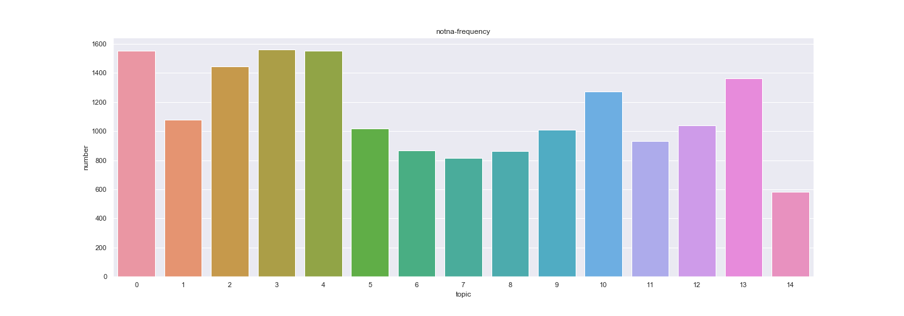

##### Plot Glättungsparamter=10<sup>-18</sup>
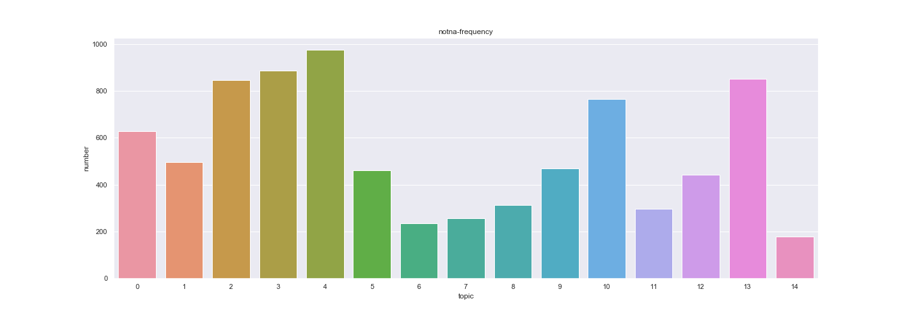

##### Schlussfolgerung
Der Plot mit dem Wert alpha=1 zeigt, dass die Dokuente gleichmäßig auf die Topics verteilt sind. Im Weiteren kann man den Plots entnehmen, dass es bei einem Glättungsparameter alpha=1 mehr Nicht-NaN-Topics gibt als bei einem Glättungsparamter alpha=10<sup>-18</sup>. Dieses Ergebnis entspricht unserer Erwartung. 

## Teil 2: Topic Modell Vergleich mit Referenz-Clustering (NHTSA)

### 2.1    
Machen Sie sich, ähnlich wie in Teil I, mit dem erstellten Topicmodell für den NHTSA-Teildatensatz vertraut, indem Sie einzelne Topics bzw. Dokumente genauer unter die Lupe nehmen. Dokumentieren Sie Ihre Erkenntnisse, d.h. in welchen Fällen Sie das Modell für sinnvoll halten und in welchen nicht.

#### Antwort:
Das folgende Listing zeigt unsere Lookup-Tabelle:
```python
topics = {
    0: 'Lighting',
    1: 'Wheels',
    2: 'Brakes',
    3: 'Air Bags',
    4: 'Trailer', 
    5: 'Engine',
    6: 'Fuel',
    7: 'Tire',
    8: 'Windshield', 
    9: 'Contact'
}
```
Die meisten Topics können eindeutig bestimmt werden. Beim dritten und vierten Topic hatten wir Schwierigkeiten bei der Zuweisung des Themas. 


### 2.2 
Überführen Sie das Soft-Clustering in ein Hard-Clustering, indem Sie einen Vektor erstellen, der pro Dokument das Topic mit der höchsten Wahrscheinlichkeit enthält. Die NHTSA-Kategorien (COMPDESCR) finden Sie bereits im Vektor docCats. Berechnen Sie auf dieser Basis die RAND-Metrik zum Vergleich von Clusterings und interpretieren Sie diese soweit möglich.

#### Antwort:
Wir haben das Soft-Clustering in ein Hard-Clustering überführt. Das folgende Listing zeigt den Python-Code:

```python
best_topic_document = []

for i in range(0, dfnhtsa.shape[0], 1):
    topic_p = dfnhtsa.to_numpy()[i].tolist()
    max_value = np.nanmax(topic_p)
    max_index = topic_p.index(max_value)
    
    best_topic_document.append((i,max_index,max_value) )
    
max_p_df = pd.DataFrame(best_topic_document, columns=['Document', 'Topic', 'Probability (P)'])
max_p_df.head(10)
```
Die Ausgabe zeigt die ersten zehn Dokumente mit den jeweiligen Topic-Wahrscheinlichkeiten.

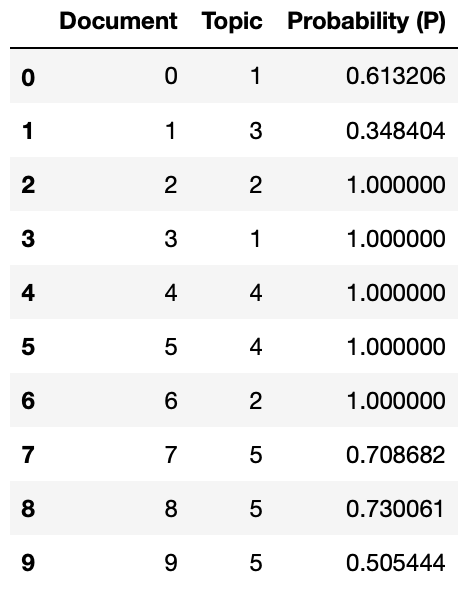

RAND-Metrik:   

<a target="_blank"></a>

Die Accuracy beträgt ca. 0,77. Die Kategorien in dem Datensatz passen gut zu den Dokumenten.

### 2.3 
Erstellen Sie eine Kreuztabellle, bei der eine Dimension die Topics und eine Dimension die Kategorien (COMPDESC) darstellen. In den Zellen soll gezählt werden, wie häufig im Corpus das Top-Topic eines Dokuments mit der tatsächlichen Kategorie korrespondiert. Nutzen Sie zur Visualisierung z.B. „clustermap“ aus der Python Bibliothek seaborn. Wie interpretieren Sie die Ergebnisse? Schauen Sie sich einzelne Dokumente als Repräsentanten/Beispiele interessanter Konstellationen in der Kreuztabelle an.

#### Antwort:
Im Folgenden ist die Kreuztabelle zu sehen.
##### Kreuztabelle
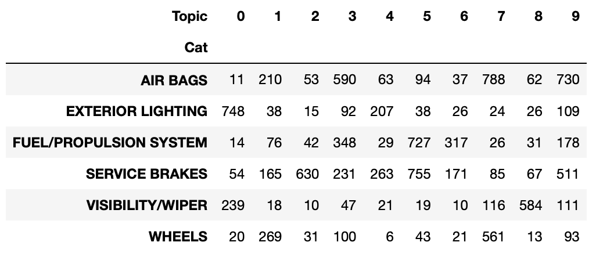   

Der folgende Plot zeigt eine Heatmap der vorherigen Kreuztabelle. 
##### Heatmap:
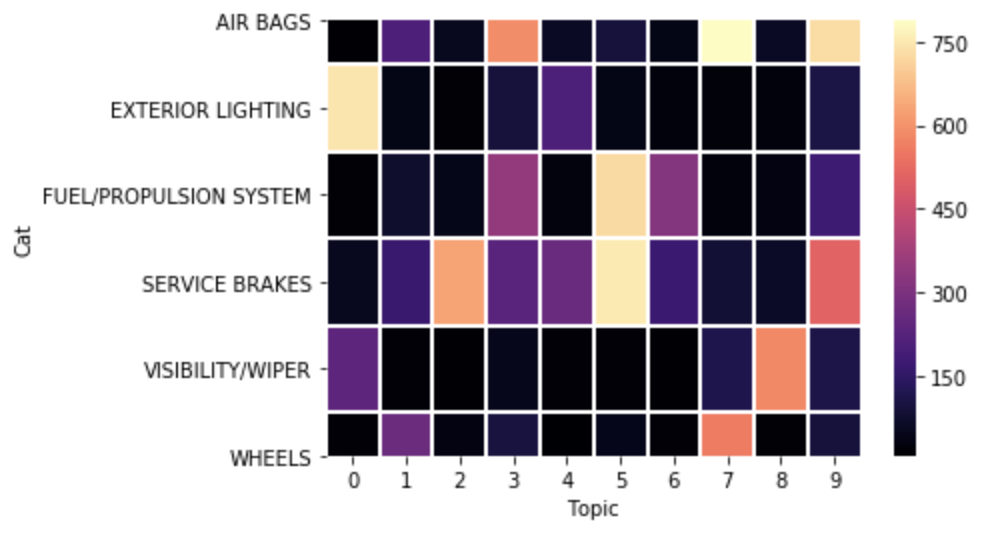

Der folgende Plot zeigt eine Clustermap der Kreuztabelle. 
##### Clustermap:
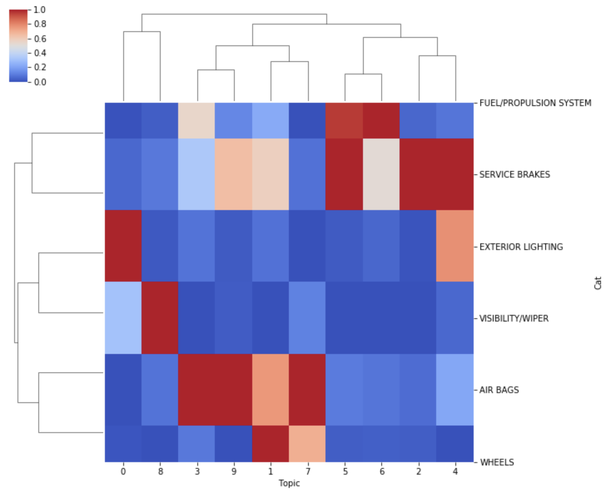

##### Interpretation:
Die Kreuztabelle zeigt, dass die Topics 7 (Tire) und 9 (Contact) häufig der Kategorie "AIR BAGS" zugeordnet werden. Man könnte daraus schließen, dass Schadensmeldungen eines Air Bags häufig mit Reifenschäden in Zusammenhang stehen.  
Des Weiteren konnte Topic 0 (Lighting) eindeutig der Kategorie "Exterior Lighting" zugewiesen werden. In der Heatmap ist dieses Ergebnis eindeutig abzulesen, da das Feld (0, Exterior Lighting) sehr hell eingefärbt ist.   
Das Topic 7 (Tire) konnte eindeutig der Kategorie "WHEELS" zugeordnet werden, dies ist ebenfalls der Heatmap zu entnehmen.

Abschließend ist in der Clustermap zu erkennen, welche Themen besonders stark in Zusammenhang stehen. Man erkennt, dass die Topics 3, 9, 1 und 7 einen höheren Zusammenhang untereinander haben, als zu anderen Topics. Das Gleiche gilt für die Topics 0 und 8, sowie für die Topics 5, 6, 2 und 4.    

Bei den Kategorien ist zu erkennen, dass die Kategorien "AIR BAGS" und "WHEELS" zusammenhängen. Außerdem stehen die Kategorien "VISIBILITY/WIPER" und "EXTERIOR LIGHTING" in Zusammenhang. Diese beiden Cluster von Kategorien stehen zusätzlich nochmal in Zusammenhang. Hingegen bilden die Kategorien "SERVICE BRAKES" und "FUEL/PROPULSION SYSTEM" ein weiteres Cluster. 

## Teil 3: Topic Modell auf eigenen gecrawlten Texten

#### Lookup Table
Das folgende Listing zeigt unsere Lookup-Tabelle:
```python
topics = {
    0: 'Software & Infrastruktur', 
    1: 'Startups',
    2: 'E-Commerce',
    3: 'Digitale Wirtschaft',
    4: 'Entwicklung & Design', 
    5: 'Mobilität',
    6: 'Gadgets & Lifestyle', 
    7: 'Karriere', 
    8: 'Digitale Gesellschaft', 
    9: 'Marketing'
}
```
Die Topics konnten eindeutig bestimmt werden.

#### Hardclustering
Wir haben das Soft-Clustering in ein Hard-Clustering überführt. Das folgende Listing zeigt den Python-Code:

```python
best_topic_document = []

for i in range(0, dft3n.shape[0], 1):
    topic_p = dft3n.to_numpy()[i].tolist()
    max_value = np.nanmax(topic_p)
    max_index = topic_p.index(max_value)
    
    best_topic_document.append((i,max_index,max_value) )
    
max_p_df = pd.DataFrame(best_topic_document, columns=['Document', 'Topic', 'Probability (P)'])
max_p_df.head(10))
```
Die Ausgabe zeigt die ersten zehn Dokumente mit den jeweiligen Topic-Wahrscheinlichkeiten.

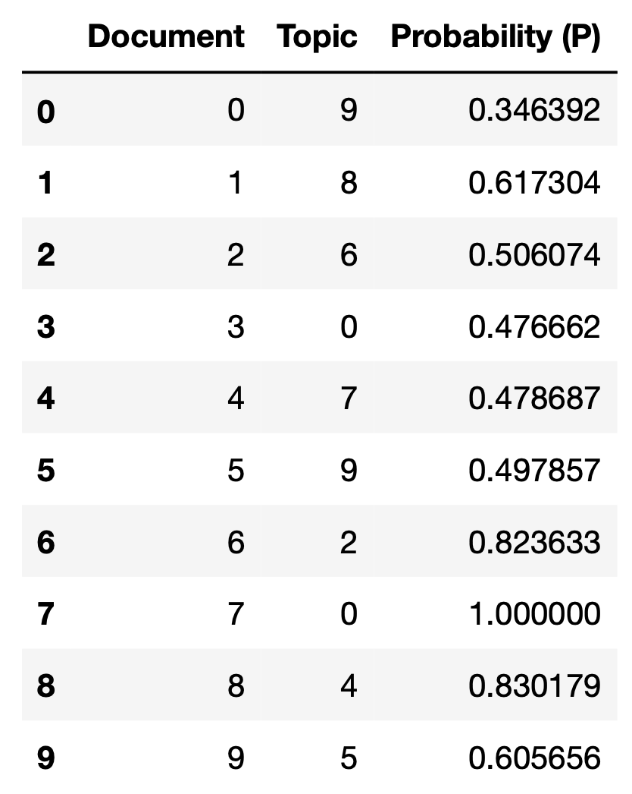

#### RAND-Metrik
 
<a target="_blank"></a>

Die Accuracy beträgt ca. 0,76. Die Kategorien in dem Datensatz passen gut zu den Dokumenten.

#### Kreuztabelle
Im Folgenden ist die Kreuztabelle zu sehen.
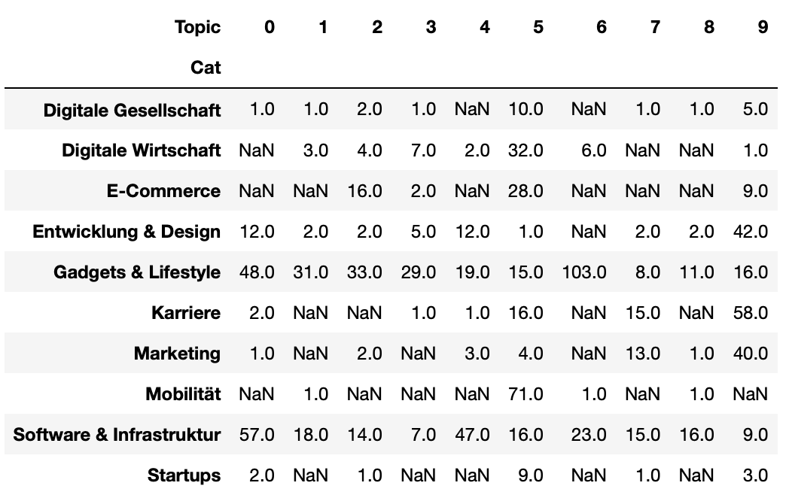   

Die Kreuztablle veranschaulicht, dass die Kategorien Gadgets & Lifestyle und Software & Infrastruktur in allen Topics Repräsentationen haben. Die Kategorie Gadgets & Lifestyle sollte man dem Topic 6 zuordnen, da der Wert hier mit 103 am größten ist. Das Kategorie Software & Infrastruktur korresponiert mit Topic 0, da hier der Wert 57 aus der Kreuztabelle abzulesen ist. 

#### Heatmap:
Der folgende Plot zeigt eine Heatmap der vorherigen Kreuztabelle. 
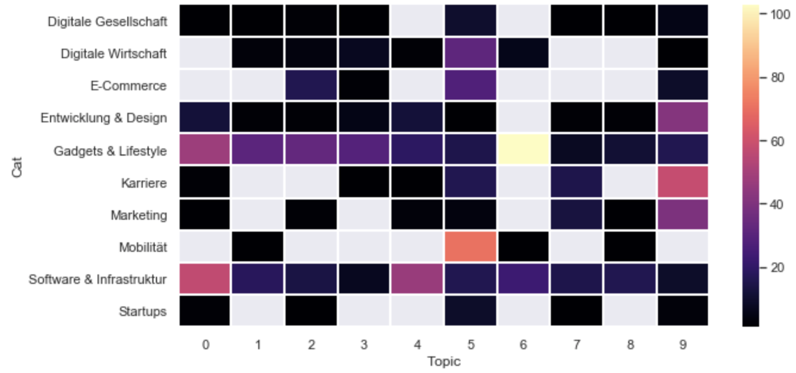

In der Heatmap sieht man nochmal, dass die Kategorie Gadgets & Lifestyle thematisch zu Topic 6 gehört. Außerdem erkennt man, dass die Kategorie Mobilität durch Topic 5 abgebildet wird.   

Im Weiteren ist in der nachfolgenden Visualisierung ebenfalls zu erkennen, dass die Kategorie Mobilität durch Topic 5 (in der Visualisierung Nummer 6) abgebildet wird. 

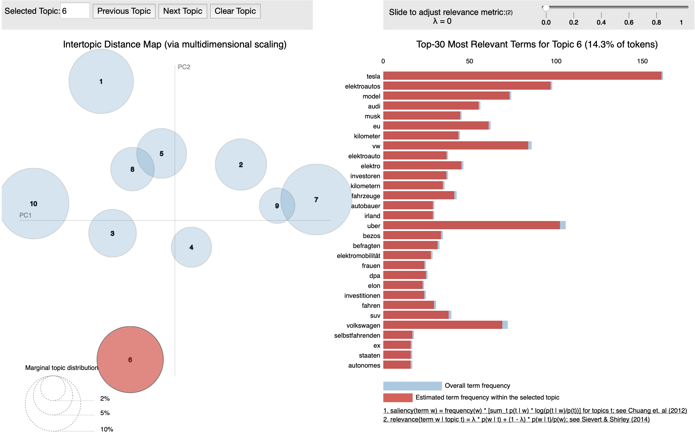

In diesem Topic kommen sehr häufig die Wörter Telsa, Elektroautos und Uber vor. Außerdem kommt der Name Elon Musk vor. Diese Wörter zeigen, dass es sich eindeutig um die Kategorie Mobilität handelt. 

#### Clustermap:
Der folgende Plot zeigt eine Clustermap der Kreuztabelle. 
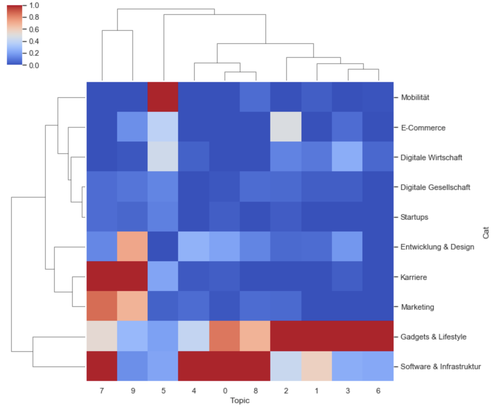

Die Clustermap zeigt neben den Häufigkeitsangaben aus der Kreuztabelle auch noch zusammenhängende Cluster an. In diesem Zusammenhang ist festzuhalten, dass die Kategorien Gadgets & Lifestyle und Software & Infrastruktur stärker in Zusammenhang stehen. Außerdem sieht man, dass die Kategorien Karriere und Marketing ähnliche Themen beinhalten. 
