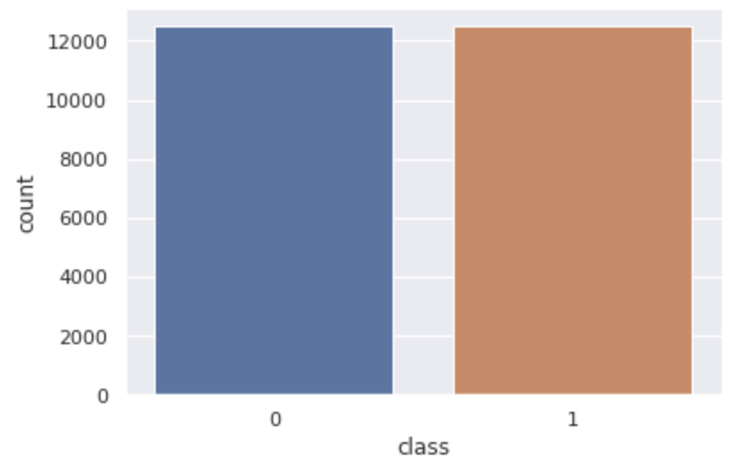
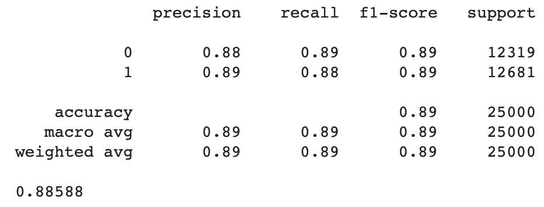
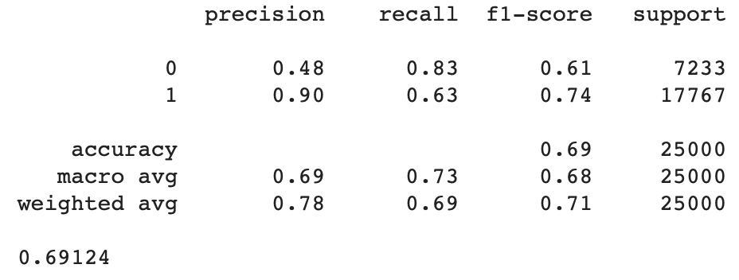

# Praktikum 5: Janik Tinz, Patrick Tinz, Tobias Rohrer (Gruppe X-D)

## Allgemein
* Link zum GitHub Repo: [https://github.com/tobirohrer/webmining](https://github.com/tobirohrer/webmining)

## Vorbereitung
Bei Reviews achtet man vor allem auf positive und negative Adjektive bzw. Adverben.

## Textklassifikation und Deep Learning
Die Aufgaben wurden im Jupyter-Notebook [Praktikum5](https://github.com/tobirohrer/webmining/blob/master/praktikum5/Praktikum5.ipynb) bearbeitet. Außerdem wurden die Aufgaben auf [Google Colab](https://colab.research.google.com/notebooks/welcome.ipynb) ausgeführt. 

### 1. Aufgabe
Machen Sie Sie sich mit dem konkreten Keras-IMDB Datensatz vertraut. Schauen Sie sich z.b. einige Review-Texte und deren Labels an. Stimmen Sie als Leser mit den Labels überein? Warum bzw. warum nicht?

#### Antwort:
Die Betrachtung der ersten zehn Review-Texte hat gezeigt, dass die Labels sehr gut für die einzelnen Reviews gewählt wurden.

### 2. Aufgabe
Identifizieren Sie die relevantesten Features (Wörter) anhand des Chi^2-Wertes auf den Trainingsdaten. Nutzen Sie dazu aus sklearn: CountVectorizer und chi2, sowie aus numpy argsort.

#### Antwort:
Die relevantesten Features (Wörter) anhand des Chi^2-Wertes sind:   
* bad
* worst
* great
* awful 
* waste 
* terrible
* movie
* excellent 
* stupid
* worse

### 3. Aufgabe
Prüfen und begründen Sie, ob „accuracy“ ein sinnvolles Gütemaß für einen Klassifikator auf diesem Datensatz ist.

#### Antwort:
Plot:   
 

Formel:   
   

Der Plot zeigt, dass die beiden Klassen (0 und 1) die gleiche Anzahl von Review-Texten enthalten. Die Fehlermetrik Accuracy kann vor allem auf balancierten Datensätzen aussagekräftig eingesetzt werden, dies trifft bei diesem Datensatz zu.

### 4. Aufgabe
Wie interpretieren Sie die Performance-Kurven und Ergebnisse auf den Testdaten zum RNN bzw. was fällt Ihnen auf?

#### Antwort:
Es ist zu erkennen, dass das RNN auf den Trainingsdaten eine deutlich bessere Performance hat als auf den Validierungsdaten. Dieses Ergebnis zeigt, dass bei diesem RNN ein Overfitting vorliegt. Das Overfitting steigt mit steigender Epochengröße an. Die Verteilung der Trainings- und der Validierungsdaten scheint sich zu unterscheiden.

### 5. Aufgabe
Schauen Sie sich einige der "drastischsten" FPs und FNs an (hoher Score und Label=1 oder niedriger Score und Label=0). Können Sie erahnen, was das Modell ggf. verwirrt hat?

#### Antwort:
Beispiel False Negative:   
"? i was very disappointed when this show was canceled although i can not vote i live on the island of i sat down to see the show on ? and was very surprised that it didn't aired the next day i read on the internet that it was canceled br br it's true not every one was as much talented as the other but there were very talented people singing br br i find it very sad for them br br that they worked so hard and there dreams came ? down br br its a pity br br"   

Das gezeigte Review ist ein positives Review, allerdings stuft das RNN es als negatives Review ein. Ein Grund hierfür sind Wörter wie "very disappointed" oder "very sad".

Beispiel False Positive:    
"? this movie made me think of how i could write something about it without personally ? the director and all the actors who as an australian i am proud of for actually getting out there and making a film br br but the movie itself let me tell you a story br br found this dvd in my local rental shop yesterday and had vague ? of the reviews at the time of cinema release here so i thought i would give it a go br br for some reason i decided to watch the ? ? before i watched the actual movie not something that i usually do turned the ? ? off halfway through as i'd had enough cringing at the ? we so wonderful for putting together such a hard hitting film with such a raw ? attitude br br the movie ugh full of clichés and pathetic character development the actors well done guys you are ? and i applaud you and just like a team is only as good as the coach that directs them you unfortunately did not have a great script to work with br br i felt that the movie actually so many of the subjects that it seemed to want to cover i have seen many reviews here that refer to it as nothing more than a soap agreed br br finally and forgive me if i don't phrase this correctly i was extremely disappointed that there were no optimistic overtones at all yes we all know that life is full of hard stuff and yes we know that things such as incest do occur but i really find it hard to applaud a movie that has not one piece of joy in it i believe that a director has a responsibility to put it in there somewhere otherwise the movie is all about them and their feelings they have created it for themselves not for an audience br br which i think is the basis of why this movie isn't so great the special features mention that the director wrote the screenplay in a ? hour sitting the day after he himself tried to end his own life well it may have been ? for him to do this however the movie ? of self ? when you know the story behind why it was written i feel horrid i'm going to write a movie about feeling horrid note i have read the interview with andrew urban and understand why needed to write something to help him through his own issues but i believe there is a line in film that cannot be crossed the line of making a movie purely for your own emotional needs and i feel that this is what has unintentionally happened here br br by his own admission the director had no technical experience at all and sadly this makes the movie come off looking like nothing more than a year twelve media project"   

Das gezeigte Review ist ein negatives Review, allerdings stuft das RNN es als positives Review ein. Ein Grund hierfür sind Wörter wie "proud of" oder "so wonderful".

### 6. Aufgabe
Optional (nur wenn Sie gut in der Zeit liegen und fit in der Materie sind!): Wie interpretieren Sie die Performance-Kurven und Ergebnisse auf den Testdaten zum RNN mit vorgelernten Glove-Embedding bzw. was fällt Ihnen auf?

#### Antwort:
Die vorgelernten Glove-Embeedings verschlechten die Performance-Kurven, da die Kantengewichtungen nicht unserem Anwendungsfall entsprechen.

### 7. Aufgabe
Wie interpretieren Sie die Performance-Kurven und Ergebnisse auf den Testdaten zum LSTM bzw. was fällt Ihnen auf?

#### Antwort:
Ein Long Short Term Memory (LSTM) ist grundsätzlich aufgebaut wie ein Rekurrentes Neuronales Netz (RNN). Zusätzlich wird noch ein extra Memory-Strang mitgeführt, welchem explizit Informationen innerhalb der Zelle entzogen bzw. hinzugefügt werden. Die Accuracy der Trainingsdaten steigt annäherend mit einer Frequenz log(x). Das LSTM ist stabiler als das RNN, da die Accuracy auf den Validierungsdaten deutlich besser ist. 

### 8. Aufgabe
Wie interpretieren Sie die Ergebnisse der „einfacheren“ Klassifikationsmodelle auf den Testdaten bzw. was fällt Ihnen auf? Inwiefern deckt sich die Wichtigkeit der Features mit der, die Sie in Aufgabe (2) ermittelt haben?

#### Antwort:
Log. Regression Report:   
 

Decision Tree Report:   
 

Man erkennt, dass die logistische Regression bessere Ergebnisse als der Decision Tree liefert. Die logistische Regression erreicht eine Accuracy von ca. 88,59 %. Hingegen erreicht der Decision Tree nur eine Accuracy von ca. 69,13 %. Die Wichtigkeit der Features decken sich größtenteils mit Aufgabe 2 (Chi2-Test). 
